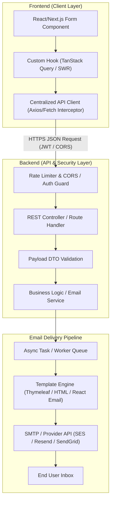

# Production-Grade API Design, UI API Calling Architecture, & Email System

A complete blueprint and reference architecture for designing REST APIs, structured UI API clients, and reliable transactional email systems.

---

## 1. High-Level Architecture Overview



---

## 2. Standard API Design Specification

### 2.1 URL Conventions & Versioning
- **Versioning**: Always prefix APIs with versioning (e.g., `/api/v1/`).
- **Naming**: Use lower-case, plural nouns for resources (e.g., `/api/v1/contact-messages`, `/api/v1/users`).
- **Actions**: Avoid verbs in resource URLs. Use standard HTTP methods:
  - `GET /api/v1/messages` - Fetch list
  - `POST /api/v1/messages` - Create new
  - `GET /api/v1/messages/{id}` - Fetch single
  - `PUT /api/v1/messages/{id}` - Update entire resource
  - `PATCH /api/v1/messages/{id}` - Partial update
  - `DELETE /api/v1/messages/{id}` - Remove resource

### 2.2 Unified Response Envelope
Standardize all API responses across your backend so the client predictable handles responses.

#### Success Envelope (`200 OK`, `201 Created`)
```json
{
  "success": true,
  "statusCode": 200,
  "message": "Contact message submitted successfully",
  "data": {
    "id": "msg_987654321",
    "status": "QUEUED",
    "createdAt": "2026-07-31T02:07:00Z"
  },
  "meta": {
    "timestamp": "2026-07-31T02:07:00Z",
    "traceId": "tr-abc123xyz"
  }
}
```

#### Standard Error Envelope (RFC 7807 Compliant)
```json
{
  "success": false,
  "statusCode": 400,
  "errorCode": "VALIDATION_FAILED",
  "message": "Invalid request parameters",
  "errors": [
    {
      "field": "email",
      "message": "Must be a valid email address"
    },
    {
      "field": "message",
      "message": "Message content must be at least 10 characters"
    }
  ],
  "meta": {
    "timestamp": "2026-07-31T02:07:00Z",
    "traceId": "tr-abc123xyz"
  }
}
```

### 2.3 HTTP Status Code Standard
| Status Code | Meaning | Use Case |
| :--- | :--- | :--- |
| `200 OK` | Success | GET, PUT, PATCH successful operations |
| `201 Created` | Resource Created | Successful POST operations |
| `202 Accepted` | Async Processing | Queued tasks (e.g., email queued) |
| `400 Bad Request` | Client Error | Validation errors, malformed JSON |
| `401 Unauthorized` | Auth Required | Missing or expired JWT / API key |
| `403 Forbidden` | Access Denied | Authenticated user lacks permission |
| `404 Not Found` | Resource Missing | Endpoint or entity ID doesn't exist |
| `429 Too Many Requests` | Rate Limited | Exceeded API quota / contact form spam |
| `500 Internal Error` | Server Error | Unhandled server exception |

---

## 3. UI API Calling Architecture (Frontend)

### 3.1 Principles
1. **Layer Separation**: Components should never call `fetch` or `axios` directly. Use a centralized API client module.
2. **Type Safety**: Strictly type requests and responses using TypeScript interfaces.
3. **Interceptor Pattern**: Handle Authorization header injection, global error mapping, and token refreshing at the client wrapper level.

### 3.2 Production API Client (`apiClient.ts`)

```typescript
// src/lib/apiClient.ts
import axios, { AxiosError, AxiosInstance, InternalAxiosRequestConfig } from 'axios';

export interface ApiResponse<T = any> {
  success: boolean;
  statusCode: number;
  message: string;
  data: T;
  meta: {
    timestamp: string;
    traceId: string;
  };
}

export interface ApiFieldError {
  field: string;
  message: string;
}

export interface ApiErrorResponse {
  success: false;
  statusCode: number;
  errorCode: string;
  message: string;
  errors?: ApiFieldError[];
  meta: {
    timestamp: string;
    traceId: string;
  };
}

const API_BASE_URL = process.env.NEXT_PUBLIC_API_URL || 'http://localhost:8080/api/v1';

export const apiClient: AxiosInstance = axios.create({
  baseURL: API_BASE_URL,
  headers: {
    'Content-Type': 'application/json',
  },
  timeout: 15000,
});

// Request Interceptor: Inject Auth Token & Trace Headers
apiClient.interceptors.request.use(
  (config: InternalAxiosRequestConfig) => {
    if (typeof window !== 'undefined') {
      const token = localStorage.getItem('auth_token');
      if (token && config.headers) {
        config.headers.Authorization = `Bearer ${token}`;
      }
    }
    return config;
  },
  (error) => Promise.reject(error)
);

// Response Interceptor: Centralized Error Normalization
apiClient.interceptors.response.use(
  (response) => response.data,
  (error: AxiosError<ApiErrorResponse>) => {
    if (error.response) {
      // Server responded with an error envelope
      return Promise.reject(error.response.data);
    } else if (error.request) {
      // Network failure / No response
      return Promise.reject<ApiErrorResponse>({
        success: false,
        statusCode: 503,
        errorCode: 'NETWORK_ERROR',
        message: 'Unable to connect to server. Please check your internet connection.',
        meta: { timestamp: new Date().toISOString(), traceId: 'client-offline' },
      });
    } else {
      return Promise.reject<ApiErrorResponse>({
        success: false,
        statusCode: 500,
        errorCode: 'UNKNOWN_CLIENT_ERROR',
        message: error.message || 'An unexpected error occurred.',
        meta: { timestamp: new Date().toISOString(), traceId: 'client-err' },
      });
    }
  }
);
```

### 3.3 Custom Hook Layer (`useContactForm.ts`)

```typescript
// src/hooks/useContactForm.ts
import { useState } from 'react';
import { apiClient, ApiResponse, ApiErrorResponse, ApiFieldError } from '@/lib/apiClient';

export interface ContactPayload {
  name: string;
  email: string;
  subject: string;
  message: string;
  honeypot?: string; // Bot protection
}

export function useContactForm() {
  const [isLoading, setIsLoading] = useState(false);
  const [fieldErrors, setFieldErrors] = useState<Record<string, string>>({});
  const [errorMessage, setErrorMessage] = useState<string | null>(null);
  const [isSuccess, setIsSuccess] = useState(false);

  const submitContactForm = async (payload: ContactPayload): Promise<boolean> => {
    // Basic bot protection check
    if (payload.honeypot) {
      setIsSuccess(true); // Silently drop spam
      return true;
    }

    setIsLoading(true);
    setFieldErrors({});
    setErrorMessage(null);
    setIsSuccess(false);

    try {
      const response = await apiClient.post<any, ApiResponse>('/contact', payload);
      if (response.success) {
        setIsSuccess(true);
        return true;
      }
      return false;
    } catch (err: any) {
      const errorResponse = err as ApiErrorResponse;
      setErrorMessage(errorResponse.message || 'Failed to submit form.');
      
      if (errorResponse.errors && errorResponse.errors.length > 0) {
        const mappedErrors: Record<string, string> = {};
        errorResponse.errors.forEach((e: ApiFieldError) => {
          mappedErrors[e.field] = e.message;
        });
        setFieldErrors(mappedErrors);
      }
      return false;
    } finally {
      setIsLoading(false);
    }
  };

  return { submitContactForm, isLoading, isSuccess, errorMessage, fieldErrors };
}
```

---

## 4. Complete Email System Architecture

### 4.1 Security & Protection Measures
1. **Honeypot Field**: Hidden UI input (`style="display:none"`). If filled, it's a bot.
2. **IP Rate Limiting**: Limit contact endpoint to e.g., 5 requests per 15 minutes per IP.
3. **HTML Sanitization**: Strip dangerous HTML tags from user input to prevent XSS.
4. **Asynchronous Execution**: Email dispatching must run asynchronously in background threads/queues to prevent HTTP client request blocking.

### 4.2 Spring Boot (Java) Implementation

#### 1. DTO & Validation
```java
// src/main/java/com/example/dto/ContactRequest.java
package com.example.dto;

import jakarta.validation.constraints.Email;
import jakarta.validation.constraints.NotBlank;
import jakarta.validation.constraints.Size;
import lombok.Data;

@Data
public class ContactRequest {

    @NotBlank(message = "Name is required")
    @Size(min = 2, max = 100, message = "Name must be between 2 and 100 characters")
    private String name;

    @NotBlank(message = "Email is required")
    @Email(message = "Must be a valid email address")
    private String email;

    @NotBlank(message = "Subject is required")
    @Size(min = 3, max = 150, message = "Subject must be between 3 and 150 characters")
    private String subject;

    @NotBlank(message = "Message is required")
    @Size(min = 10, max = 3000, message = "Message must be between 10 and 3000 characters")
    private String message;

    private String honeypot; // Should remain blank
}
```

#### 2. Email Service (`@Async` Non-Blocking)
```java
// src/main/java/com/example/service/EmailService.java
package com.example.service;

import jakarta.mail.MessagingException;
import jakarta.mail.internet.MimeMessage;
import lombok.RequiredArgsConstructor;
import lombok.extern.slf4j.Slf4j;
import org.springframework.beans.factory.annotation.Value;
import org.springframework.mail.javamail.JavaMailSender;
import org.springframework.mail.javamail.MimeMessageHelper;
import org.springframework.scheduling.annotation.Async;
import org.springframework.stereotype.Service;
import org.thymeleaf.TemplateEngine;
import org.thymeleaf.context.Context;

import java.nio.charset.StandardCharsets;

@Slf4j
@Service
@RequiredArgsConstructor
public class EmailService {

    private final JavaMailSender mailSender;
    private final TemplateEngine templateEngine;

    @Value("${app.email.from}")
    private String fromEmail;

    @Value("${app.email.admin}")
    private String adminEmail;

    @Async
    public void sendContactNotificationAsync(String name, String userEmail, String subject, String content) {
        try {
            // Prepare Thymeleaf Context
            Context context = new Context();
            context.setVariable("name", name);
            context.setVariable("email", userEmail);
            context.setVariable("subject", subject);
            context.setVariable("message", content);

            // Process HTML Template
            String htmlContent = templateEngine.process("email/contact-template", context);

            // Send Admin Notification
            MimeMessage message = mailSender.createMimeMessage();
            MimeMessageHelper helper = new MimeMessageHelper(message, MimeMessageHelper.MULTIPART_MODE_MIXED_RELATED, StandardCharsets.UTF_8.name());
            
            helper.setFrom(fromEmail);
            helper.setTo(adminEmail);
            helper.setReplyTo(userEmail);
            helper.setSubject("New Contact Submission: " + subject);
            helper.setText(htmlContent, true);

            mailSender.send(message);
            log.info("Contact email notification sent successfully for user: {}", userEmail);

        } catch (MessagingException e) {
            log.error("Failed to send contact email notification to admin", e);
        }
    }
}
```

#### 3. Controller Implementation
```java
// src/main/java/com/example/controller/ContactController.java
package com.example.controller;

import com.example.dto.ContactRequest;
import com.example.dto.ApiResponse;
import com.example.service.EmailService;
import jakarta.validation.Valid;
import lombok.RequiredArgsConstructor;
import org.springframework.http.ResponseEntity;
import org.springframework.web.bind.annotation.*;

import java.time.Instant;
import java.util.UUID;

@RestController
@RequestMapping("/api/v1/contact")
@RequiredArgsConstructor
public class ContactController {

    private final EmailService emailService;

    @PostMapping
    public ResponseEntity<ApiResponse<Void>> handleContactSubmission(@Valid @RequestBody ContactRequest request) {
        // Honeypot bot filter
        if (request.getHoneypot() != null && !request.getHoneypot().isEmpty()) {
            return ResponseEntity.ok(new ApiResponse<>(true, 200, "Message processed", null, new ApiResponse.Meta(Instant.now(), UUID.randomUUID().toString())));
        }

        // Trigger Async Email Dispatch
        emailService.sendContactNotificationAsync(
                request.getName(),
                request.getEmail(),
                request.getSubject(),
                request.getMessage()
        );

        ApiResponse<Void> response = new ApiResponse<>(
                true,
                200,
                "Your message has been received! We will respond shortly.",
                null,
                new ApiResponse.Meta(Instant.now(), UUID.randomUUID().toString())
        );

        return ResponseEntity.ok(response);
    }
}
```

---

### 4.3 Node.js / TypeScript Alternative Implementation (Nodemailer / Resend)

```typescript
// backend/services/emailService.ts
import nodemailer from 'nodemailer';

const transporter = nodemailer.createTransport({
  host: process.env.SMTP_HOST || 'smtp.mailtrap.io',
  port: Number(process.env.SMTP_PORT) || 2525,
  auth: {
    user: process.env.SMTP_USER,
    pass: process.env.SMTP_PASS,
  },
});

export interface SendEmailOptions {
  to: string;
  subject: string;
  name: string;
  userEmail: string;
  message: string;
}

export async function sendContactEmailAsync(options: SendEmailOptions): Promise<void> {
  const htmlTemplate = `
    <!DOCTYPE html>
    <html>
      <head>
        <style>
          body { font-family: 'Segoe UI', Tahoma, Geneva, Verdana, sans-serif; background-color: #f4f6f9; padding: 20px; }
          .card { background-color: #ffffff; padding: 30px; border-radius: 8px; box-shadow: 0 4px 12px rgba(0,0,0,0.05); }
          .header { border-bottom: 2px solid #3b82f6; padding-bottom: 10px; margin-bottom: 20px; }
          .field { margin-bottom: 12px; }
          .label { font-weight: bold; color: #4b5563; }
          .content { background-color: #f9fafb; padding: 15px; border-left: 4px solid #3b82f6; border-radius: 4px; }
        </style>
      </head>
      <body>
        <div class="card">
          <div class="header">
            <h2>New Contact Inquiry</h2>
          </div>
          <div class="field"><span class="label">From:</span> ${options.name} (${options.userEmail})</div>
          <div class="field"><span class="label">Subject:</span> ${options.subject}</div>
          <div class="field"><span class="label">Message:</span></div>
          <div class="content">${options.message.replace(/\n/g, '<br/>')}</div>
        </div>
      </body>
    </html>
  `;

  await transporter.sendMail({
    from: `"${options.name}" <${process.env.EMAIL_FROM}>`,
    to: options.to,
    replyTo: options.userEmail,
    subject: `Contact Form: ${options.subject}`,
    html: htmlTemplate,
  });
}
```

---

## 5. UI Contact Form Component (React & Tailwind Example)

```tsx
// src/components/ContactForm.tsx
import React, { useState } from 'react';
import { useContactForm } from '@/hooks/useContactForm';

export const ContactForm: React.FC = () => {
  const { submitContactForm, isLoading, isSuccess, errorMessage, fieldErrors } = useContactForm();
  
  const [formData, setFormData] = useState({
    name: '',
    email: '',
    subject: '',
    message: '',
    honeypot: '',
  });

  const handleSubmit = async (e: React.FormEvent) => {
    e.preventDefault();
    const success = await submitContactForm(formData);
    if (success) {
      setFormData({ name: '', email: '', subject: '', message: '', honeypot: '' });
    }
  };

  return (
    <div className="max-w-xl mx-auto p-6 bg-white rounded-xl shadow-md border border-gray-100">
      <h2 className="text-2xl font-bold text-gray-800 mb-4">Get in Touch</h2>

      {isSuccess && (
        <div className="mb-4 p-4 bg-green-50 text-green-700 border border-green-200 rounded-lg">
          Thank you! Your message has been sent successfully.
        </div>
      )}

      {errorMessage && (
        <div className="mb-4 p-4 bg-red-50 text-red-700 border border-red-200 rounded-lg">
          {errorMessage}
        </div>
      )}

      <form onSubmit={handleSubmit} className="space-y-4">
        {/* Honeypot field (hidden from real users) */}
        <input
          type="text"
          name="website_url"
          value={formData.honeypot}
          onChange={(e) => setFormData({ ...formData, honeypot: e.target.value })}
          className="hidden"
          tabIndex={-1}
          autoComplete="off"
        />

        <div>
          <label className="block text-sm font-medium text-gray-700">Name</label>
          <input
            type="text"
            required
            value={formData.name}
            onChange={(e) => setFormData({ ...formData, name: e.target.value })}
            className={`mt-1 block w-full rounded-md border p-2 ${
              fieldErrors.name ? 'border-red-500' : 'border-gray-300'
            }`}
          />
          {fieldErrors.name && <p className="text-xs text-red-500 mt-1">{fieldErrors.name}</p>}
        </div>

        <div>
          <label className="block text-sm font-medium text-gray-700">Email</label>
          <input
            type="email"
            required
            value={formData.email}
            onChange={(e) => setFormData({ ...formData, email: e.target.value })}
            className={`mt-1 block w-full rounded-md border p-2 ${
              fieldErrors.email ? 'border-red-500' : 'border-gray-300'
            }`}
          />
          {fieldErrors.email && <p className="text-xs text-red-500 mt-1">{fieldErrors.email}</p>}
        </div>

        <div>
          <label className="block text-sm font-medium text-gray-700">Subject</label>
          <input
            type="text"
            required
            value={formData.subject}
            onChange={(e) => setFormData({ ...formData, subject: e.target.value })}
            className={`mt-1 block w-full rounded-md border p-2 ${
              fieldErrors.subject ? 'border-red-500' : 'border-gray-300'
            }`}
          />
          {fieldErrors.subject && <p className="text-xs text-red-500 mt-1">{fieldErrors.subject}</p>}
        </div>

        <div>
          <label className="block text-sm font-medium text-gray-700">Message</label>
          <textarea
            required
            rows={4}
            value={formData.message}
            onChange={(e) => setFormData({ ...formData, message: e.target.value })}
            className={`mt-1 block w-full rounded-md border p-2 ${
              fieldErrors.message ? 'border-red-500' : 'border-gray-300'
            }`}
          />
          {fieldErrors.message && <p className="text-xs text-red-500 mt-1">{fieldErrors.message}</p>}
        </div>

        <button
          type="submit"
          disabled={isLoading}
          className="w-full py-2.5 px-4 bg-blue-600 hover:bg-blue-700 text-white font-medium rounded-lg transition-colors disabled:opacity-50"
        >
          {isLoading ? 'Sending...' : 'Send Message'}
        </button>
      </form>
    </div>
  );
};
```

---

## 6. Checklist for Production Deployment

- [ ] **DKIM, SPF & DMARC**: Configure DNS records for your sending domain to prevent emails landing in SPAM.
- [ ] **CORS Settings**: Whitelist specific frontend domains (e.g., `https://yourdomain.com`).
- [ ] **Rate Limiting**: Protect endpoints using Redis / Bucket4j / `express-rate-limit`.
- [ ] **Environment Variables**: Never hardcode SMTP passwords or secret keys.
- [ ] **SSL/TLS (HTTPS)**: Ensure all API endpoints enforce HTTPS.
