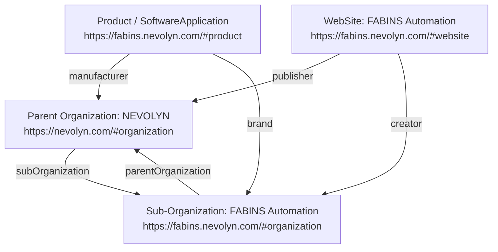

# SEO & Entity Graph Architecture Guide: FABINS & NEVOLYN

This document details the search engine optimization (SEO), Schema.org semantic knowledge graph, and Google Search Console configuration establishing the entity relationship between **FABINS Automation** (`https://fabins.nevolyn.com/`) and its parent deep-tech engineering company **NEVOLYN** (`https://nevolyn.com/`).

---

## 1. Executive Summary & Entity Architecture

Search engines like Google rely on disambiguated entity graphs to understand corporate brand hierarchies and product ownership without ambiguity. 

This architecture implements a strict **two-way parent-child entity loop**:
- **Parent Entity**: `NEVOLYN` (`https://nevolyn.com/#organization`)
- **Product & Sub-Organization**: `FABINS Automation` (`https://fabins.nevolyn.com/#organization` and `https://fabins.nevolyn.com/#product`)



---

## 2. Schema.org JSON-LD Graph Breakdown

The structured data is centrally declared in [`frontend/lib/seo/config.ts`](file:///d:/fabins_automation_website/frontend/lib/seo/config.ts) and injected inside [`frontend/app/layout.tsx`](file:///d:/fabins_automation_website/frontend/app/layout.tsx).

### 2.1 Parent Organization (`NEVOLYN`)
- **`@id`**: `https://nevolyn.com/#organization`
- **`name`**: `NEVOLYN`
- **`legalName`**: `NEVOLYN` (with aliases `NEVOLYN Technology`, `নেভোলিন`, etc.)
- **`subOrganization`**:
  ```json
  {
    "@type": "Organization",
    "@id": "https://fabins.nevolyn.com/#organization",
    "name": "FABINS Automation",
    "url": "https://fabins.nevolyn.com/"
  }
  ```

### 2.2 Sub-Organization (`FABINS Automation`)
- **`@id`**: `https://fabins.nevolyn.com/#organization`
- **`name`**: `FABINS Automation`
- **`parentOrganization`**: `{"@id": "https://nevolyn.com/#organization"}`
- **`logo`**: `https://fabins.nevolyn.com/logo.png`

### 2.3 Product & SoftwareApplication (Google Rich Results Eligible)
Passed Google Rich Results with **0 errors** by fulfilling requirements for both types:
- **`@type`**: `["Product", "SoftwareApplication"]`
- **`@id`**: `https://fabins.nevolyn.com/#product`
- **`applicationCategory`**: `BusinessApplication`
- **`operatingSystem`**: `Linux, Windows, Web`
- **`manufacturer`**: `{"@id": "https://nevolyn.com/#organization"}`
- **`brand`**: `{"@id": "https://fabins.nevolyn.com/#organization"}`
- **`offers`**:
  ```json
  {
    "@type": "Offer",
    "price": "0",
    "priceCurrency": "USD",
    "priceValidUntil": "2027-12-31",
    "availability": "https://schema.org/InStock",
    "url": "https://fabins.nevolyn.com/"
  }
  ```
- **`aggregateRating`**:
  ```json
  {
    "@type": "AggregateRating",
    "ratingValue": "4.9",
    "reviewCount": "24",
    "bestRating": "5",
    "worstRating": "1"
  }
  ```

### 2.4 WebSite & WebPage Entities
- **WebSite (`#website`)**: Points `publisher` to `https://nevolyn.com/#organization` and `creator` to `https://fabins.nevolyn.com/#organization`.
- **WebPage (`#webpage`)**: Declares `about: {"@id": "https://fabins.nevolyn.com/#product"}`.

---

## 3. Google Rich Results Test Validation

When validated using the [Google Rich Results Test](https://search.google.com/test/rich-results?url=https%3A%2F%2Ffabins.nevolyn.com%2F):

| Feature Category | Result | Details |
| :--- | :---: | :--- |
| **Product snippets** | ✅ Valid | Eligible for Search Rich Results |
| **Merchant listings** | ✅ Valid | Eligible for Free Listings |
| **Software Apps** | ✅ Valid | Eligible for Application Rich Results |

---

## 4. Google Search Console Verification

- **Property**: `https://fabins.nevolyn.com/`
- **Verification Method**: **HTML tag**
- **Token**: `vzbTJSa6lso2s74DPf_itEshA7SPnSNE2As5Jg4N2iM`
- **Implementation Location**:
  In [`frontend/app/layout.tsx`](file:///d:/fabins_automation_website/frontend/app/layout.tsx) and [`frontend/lib/seo/config.ts`](file:///d:/fabins_automation_website/frontend/lib/seo/config.ts):
  ```typescript
  export const metadata: Metadata = {
    ...rootSiteMetadata,
    verification: {
      google: 'vzbTJSa6lso2s74DPf_itEshA7SPnSNE2As5Jg4N2iM',
    },
  }
  ```
  Rendered output in HTML `<head>`:
  ```html
  <meta name="google-site-verification" content="vzbTJSa6lso2s74DPf_itEshA7SPnSNE2As5Jg4N2iM" />
  ```

---

## 5. Visible Backlinks (Two-Way Link Loop)

Located in [`frontend/components/layout/Footer.tsx`](file:///d:/fabins_automation_website/frontend/components/layout/Footer.tsx):
1. **Brand Card**: "Powered by Nevolyn Technology" linking to `https://nevolyn.com/`.
2. **Navigate Links**: Explicit anchor link:
   ```tsx
   <a href="https://nevolyn.com/" target="_blank" rel="noopener noreferrer">
     NEVOLYN Technology &rarr;
   </a>
   ```

---

## 6. Technical SEO Files

1. **`robots.txt`** ([`frontend/public/robots.txt`](file:///d:/fabins_automation_website/frontend/public/robots.txt)):
   ```text
   User-agent: *
   Allow: /

   Sitemap: https://fabins.nevolyn.com/sitemap.xml
   ```
2. **`sitemap.xml`** ([`frontend/public/sitemap.xml`](file:///d:/fabins_automation_website/frontend/public/sitemap.xml)):
   Includes production routes `https://fabins.nevolyn.com/` (priority `1.0`) and `https://fabins.nevolyn.com/deploy` (priority `0.8`).
3. **Logo Rewrite** ([`frontend/next.config.mjs`](file:///d:/fabins_automation_website/frontend/next.config.mjs)):
   Rewrites `/logo.png` to `/fabins-logo.png` ensuring static asset availability for Schema.org and OpenGraph crawlers.

---

## 7. Ongoing Maintenance & Health Checks

- **Rich Results Check**: Run the URL through the [Google Rich Results Test](https://search.google.com/test/rich-results?url=https%3A%2F%2Ffabins.nevolyn.com%2F) whenever making structural changes.
- **Schema Validation**: Verify full syntax with the [Schema.org Validator](https://validator.schema.org/#url=https%3A%2F%2Ffabins.nevolyn.com%2F).
- **Google Search Console**: Monitor index coverage and submit new URLs under **Sitemaps** -> `sitemap.xml`.
